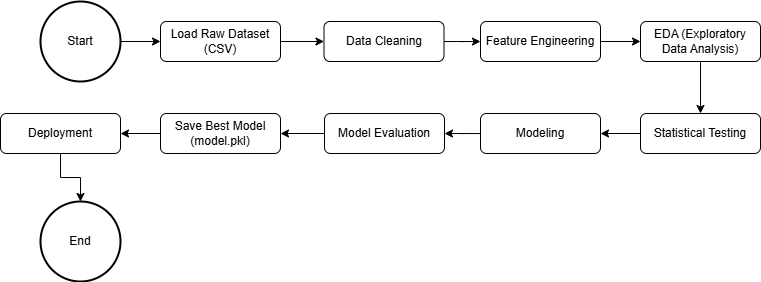

# 🏨 Stay or Go: Predicting and Understanding Booking Cancellations  
Purwadhika JC Data Science & Machine Learning Bootcamp Final Project

---

## 👥 Team Alpha
- Alexandra Andira (JCDS-2804-015)  
- Vanessa Alexandra (JCDS-2804-014)

---

## 📌 Project Overview

Hotel booking cancellations pose an ongoing challenge for the hospitality industry. Beyond lost revenue, they create operational inefficiencies, such as unused rooms, wasted resources, and inaccurate demand forecasting.

This project aims to help hotels move from reactive responses to proactive decision-making. By building a machine learning model that predicts the likelihood of a booking being canceled, we enable hotels to identify high-risk reservations early. With this insight, hotels can improve guest communication, apply targeted interventions, adjust overbooking strategies, and optimize pricing policies.

Our work combines data exploration, predictive modeling, and visualization to provide actionable insights that address a real business problem in a data-driven way.

---

## 🧠 Business Understanding

### 🎯 Problem Statement
Hotels care deeply about cancellations because the consequences are immediate and measurable. Canceled bookings result in unfulfilled revenue, a drop in room utilization, and operational inefficiencies. These problems are only made worse by the fact that cancellations are not random, they are often influenced by several underlying factors:
1. A guest’s profile can be indicative of cancellation risk. 
2. The timing of the booking, such as how far in advance it was made, also plays a role. 
3. The type of customer, whether they’re an individual traveler or part of a group—and the channel through which the booking was made can also have a significant influence. 
4. Seasonal patterns further complicate the picture, as some months naturally see higher cancellation activity than others.

Understanding these patterns is key to making sense of why cancellations happen and how they can be addressed.

### 💼 Stakeholders
The impact of booking cancellations goes beyond just one team. It cuts across several key departments in hotel operations:
1. **Revenue Managers**
For instance, rely on accurate demand forecasts to set prices, manage overbooking strategies, and avoid lost revenue.
2. **Front Office**
Manage daily check-ins, guest communications, and daily room schedules, all of which are directly affected by last-minute cancellations.
3. **Housekeeping and Operations**
Need reliable occupancy projections to allocate cleaning staff, prepare rooms, and manage resources efficiently.
4. **General Managers and Executives**
Focus on overall business performance. Cancellations impact Revenue Per Available Room, occupancy rates, and guest satisfaction.

Each of these stakeholders has a different concern, but they are all connected by one thing: the need to better understand, manage, and reduce cancellations.

---

## 🎯 Project Objectives

The purpose of this analysis is to mitigate the risks associated with booking cancellations by building a machine learning model that predicts the likelihood of a cancellation based on reservation details available at the time of booking. These objectives can be broken down into the following key areas:

1. **Revenue Management and Forecasting**

    Cancellations distort demand forecasts. A room that's booked and then cancelled might cause the hotel to **over-** or **underprice** remaining rooms. Overbooking strategies, while common, are risky without reliable predictions.

    With more accurate predictions, hotels can optimize their pricing strategy and reduce the risk of revenue loss due to poor forecasting.

2. **Inventory and Operational Efficiency**

    By predicting which bookings are likely to result in no-shows or cancellations, hotel staff can better plan room assignments and cleaning schedules, avoid over-preparation, and reallocate resources more efficiently.

3. **Targeted Interventions**

    Predicting cancellations allows hotels to contact at-risk guests early; offering better service, upgrades, or confirmations to reduce the likelihood of cancellations.

    Rather than sending messages or perks to all guests (which is costly), predictions help target only those most likely to cancel.

4. **Reducing Last-Minute Cancellations and Revenue Leakage**

    A cancellation 30 days in advance is manageable. One the night before is not, as a canceled booking close to arrival is often impossible to be refilled, which means perishable inventory loss; that room's potential revenue is gone forever. Predictive models help catch late-stage cancellations earlier, so the room can be resold or reallocated.

5. **Strategic Decision-Making and Dynamic Pricing**
    
    Predictive insights help optimize cancellations policies: Should the hotel tighten or relax its refund windows? What booking sources cancel more? By knowing which kinds of bookings are riskier can influence how aggressively the hotel prices rooms and whether to ask for deposits or full repayment.

This project develops a machine learning model that predicts booking cancellations using reservation details, helping hotels minimize losses, improve forecasts, and deliver smarter guest experiences.

---

## 📊 Analytical Approach

### 💡 Problem Type
*Supervised Binary Classification*  
Target: is_canceled → 0 = Not Canceled, 1 = Canceled

### 🛠 Algorithms Used
Not limited to:
- Logistic Regression
- Decision Tree
- Random Forest
- XGBoost / LightGBM

### 🧪 Evaluation Metrics
- Precision, Recall, F1-Score
- ROC AUC
- Confusion Matrix

---



---

## 🧾 Dataset Overview

*Source*: [Hotel Booking Demand - Kaggle](https://www.kaggle.com/datasets/jessemostipak/hotel-booking-demand)  
*Original Paper*: [Antonio et al. (2019)](https://www.sciencedirect.com/science/article/pii/S2352340918315191#bib5)

Collected from:
- *Resort Hotel* (Algarve region)
- *City Hotel* (Lisbon)

*Size*: 119,000+ records | 32 features

### 📌 Key Features
| Category | Examples |
|----------|----------|
| *Booking Info* | lead_time, booking_changes, deposit_type |
| *Customer Info* | adults, children, is_repeated_guest |
| *Timing* | arrival_date_month, arrival_date_week_number |
| *Room Details* | reserved_room_type, assigned_room_type, total_of_special_requests |
| *Financial* | adr (average daily rate), meal, market_segment |
| *Target Variable* | is_canceled (1 = canceled, 0 = not canceled) |

---

## Dependecies

```
pip install -r requirements.txt
```

## 🚀 Deployment Guide: Streamlit App
📦 Persyaratan
Pastikan kamu telah menginstal:
- Python ≥ 3.8
- pip (Python package installer)

🛠️ Cara Install dan Jalankan Aplikasi di Lokal
1. Clone repository ini
```
git clone https://github.com/PurwadhikaDev/AlphaGroup_JC_DS_FT_JKT_28_FinalProject.git
cd AlphaGroup_JC_DS_FT_JKT_28_FinalProject
```

2. Buat virtual environment (opsional tapi disarankan)
```
python -m venv venv
source venv/bin/activate      # Mac/Linux
venv\Scripts\activate         # Windows
```

3. Install dependencies
```
pip install -r requirements.txt
```

4. Jalankan aplikasi Streamlit
streamlit run app.py
Aplikasi akan terbuka otomatis di browser. Jika tidak, kunjungi URL:
http://localhost:8501

🌐 Deploy ke Streamlit Cloud (Optional)
1. Buka streamlit.io dan login menggunakan akun GitHub.
2. Klik "New app" → pilih repositori ini:
```
PurwadhikaDev/AlphaGroup_JC_DS_FT_JKT_28_FinalProject
```
3. Isi pengaturan berikut:
Branch: main (atau master, sesuaikan dengan repositorimu)

File path: main.py

4. Klik Deploy
💡 *Pastikan file model.pkl dan dataset (jika diperlukan) sudah di-push ke repo/public storage sebelum deploy.

---

## 🚀 Features
- Hyperparameter tuning using RandomizedSearchCV
- Feature selection with SHAP/Permutation Importance
- Deployment via Streamlit for real-time prediction
  
---

## 📬 Contact

For any questions or feedback, feel free to reach out via GitHub or LinkedIn.  
Thanks for visiting!

---
